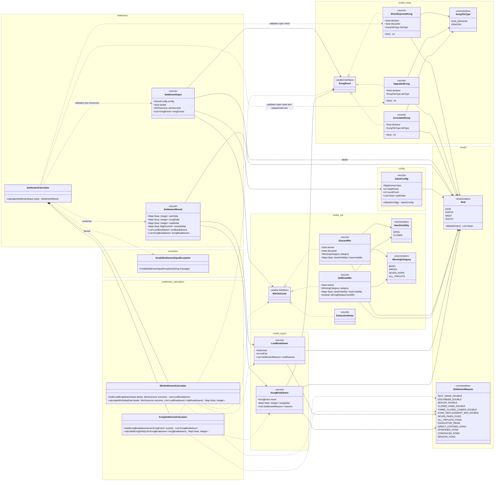

# Domain UML

This diagram describes the current framework-free settlement domain under
`com.hadjshell.mahjong.domain`.

```mermaid
classDiagram
    direction LR

    namespace config {
        class GameConfig {
            <<record>>
            +BigDecimal base
            +int initialPoints
            +int roundCount
            +List~Seat~ seatOrder
            +defaultConfig() GameConfig
        }
    }

    namespace model {
        class Seat {
            <<enumeration>>
            EAST
            NORTH
            WEST
            SOUTH
            +defaultOrder() List~Seat~
        }

        class SettlementReason {
            <<enumeration>>
            SELF_DRAW_DOUBLE
            DISCARDER_DOUBLE
            DEALER_DOUBLE
            CLOSED_HAND_DOUBLE
            THREE_CLOSED_LOSERS_DOUBLE
            KONG_REPLACEMENT_WIN_DOUBLE
            SEVEN_PAIRS_FIXED
            ALL_TRIPLETS_FIXED
            EXHAUSTIVE_DRAW
            DIRECT_EXPOSED_KONG
            UPGRADED_KONG
            CONCEALED_KONG
            DRAGON_KONG
        }
    }

    namespace model_win {
        class WinOutcome {
            <<sealed interface>>
        }

        class DiscardWin {
            <<record>>
            +Seat winner
            +Seat discarder
            +WinningCategory category
            +Map~Seat, HandVisibility~ loserVisibility
        }

        class SelfDrawWin {
            <<record>>
            +Seat winner
            +WinningCategory category
            +Map~Seat, HandVisibility~ loserVisibility
            +boolean isKongReplacementWin
        }

        class ExhaustiveDraw {
            <<record>>
        }

        class HandVisibility {
            <<enumeration>>
            OPEN
            CLOSED
        }

        class WinningCategory {
            <<enumeration>>
            BASIC
            SINGLE
            SEVEN_PAIRS
            ALL_TRIPLETS
        }
    }

    namespace model_kong {
        class KongEvent {
            <<sealed interface>>
        }

        class DirectExposedKong {
            <<record>>
            +Seat declarer
            +Seat discarder
            +KongTileType tileType
            +fan() int
        }

        class UpgradedKong {
            <<record>>
            +Seat declarer
            +KongTileType tileType
            +fan() int
        }

        class ConcealedKong {
            <<record>>
            +Seat declarer
            +KongTileType tileType
            +fan() int
        }

        class KongTileType {
            <<enumeration>>
            NON_DRAGON
            DRAGON
        }
    }

    namespace model_report {
        class LostBreakdown {
            <<record>>
            +Seat loser
            +int lostFan
            +List~SettlementReason~ lostReasons
        }

        class KongBreakdown {
            <<record>>
            +KongEvent event
            +Map~Seat, Integer~ kongDelta
            +List~SettlementReason~ reasons
        }
    }

    namespace settlement {
        class SettlementInput {
            <<record>>
            +GameConfig config
            +Seat dealer
            +WinOutcome winOutcome
            +List~KongEvent~ kongEvents
        }

        class SettlementResult {
            <<record>>
            +Map~Seat, Integer~ winDelta
            +Map~Seat, Integer~ kongDelta
            +Map~Seat, Integer~ totalDelta
            +Map~Seat, BigDecimal~ moneyDelta
            +List~LostBreakdown~ lostBreakdowns
            +List~KongBreakdown~ kongBreakdowns
        }

        class SettlementCalculator {
            +calculate(SettlementInput input) SettlementResult
        }
    }

    namespace settlement_calculation {
        class WinSettlementCalculator {
            +buildLostBreakdowns(Seat dealer, WinOutcome outcome) List~LostBreakdown~
            +calculateWinDelta(Seat dealer, WinOutcome outcome, List~LostBreakdown~ lostBreakdowns) Map~Seat, Integer~
        }

        class KongSettlementCalculator {
            +buildKongBreakdowns(List~KongEvent~ events) List~KongBreakdown~
            +calculateKongDelta(List~KongBreakdown~ kongBreakdowns) Map~Seat, Integer~
        }
    }

    namespace exception {
        class InvalidSettlementInputException {
            +InvalidSettlementInputException(String message)
        }
    }

    WinOutcome <|.. DiscardWin
    WinOutcome <|.. SelfDrawWin
    WinOutcome <|.. ExhaustiveDraw

    KongEvent <|.. DirectExposedKong
    KongEvent <|.. UpgradedKong
    KongEvent <|.. ConcealedKong

    SettlementCalculator *-- WinSettlementCalculator
    SettlementCalculator *-- KongSettlementCalculator
    SettlementCalculator ..> SettlementInput : validates and consumes
    SettlementCalculator ..> SettlementResult : produces
    SettlementCalculator ..> InvalidSettlementInputException : throws
    SettlementCalculator ..> DirectExposedKong : validates open hand
    SettlementCalculator ..> UpgradedKong : validates open hand and replacement win

    SettlementInput --> GameConfig
    SettlementInput --> Seat : dealer
    SettlementInput --> WinOutcome
    SettlementInput --> KongEvent

    SettlementResult --> Seat
    SettlementResult --> LostBreakdown
    SettlementResult --> KongBreakdown

    WinSettlementCalculator ..> WinOutcome
    WinSettlementCalculator ..> LostBreakdown
    WinSettlementCalculator ..> SettlementReason

    KongSettlementCalculator ..> KongEvent
    KongSettlementCalculator ..> KongBreakdown
    KongSettlementCalculator ..> SettlementReason

    GameConfig --> Seat

    DiscardWin --> Seat
    DiscardWin --> WinningCategory
    DiscardWin --> HandVisibility

    SelfDrawWin --> Seat
    SelfDrawWin --> WinningCategory
    SelfDrawWin --> HandVisibility

    DirectExposedKong --> Seat
    DirectExposedKong --> KongTileType
    UpgradedKong --> Seat
    UpgradedKong --> KongTileType
    ConcealedKong --> Seat
    ConcealedKong --> KongTileType

    LostBreakdown --> Seat
    LostBreakdown --> SettlementReason
    KongBreakdown --> KongEvent
    KongBreakdown --> Seat
    KongBreakdown --> SettlementReason
```
